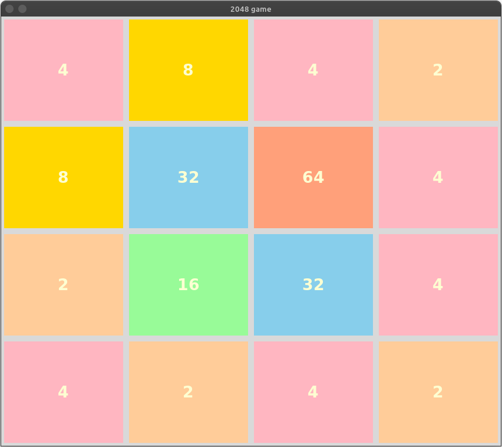

# 2048 Game

This project is a basic implementation of the 2048 game using the Tkinter library in Python. It's *not finished* yet.



## Table of Contents

- [Introduction](#introduction)
- [Features](#features)
- [Installation](#installation)
- [How to Play](#how-to-play)
- [Code Structure](#code-structure)
- [Contributing](#contributing)
- [License](#license)
- [Inspiration](#inspiration)

## Introduction

2048 is a sliding block puzzle game where the objective is to combine tiles with the same numbers to reach the 2048 tile. This implementation uses Tkinter for the GUI.

## Features

- Simple 4x4 grid-based game board.
- Supports moving tiles up, down, left, and right.
- Merges tiles with the same numbers.
- Generates new tiles after each move.
- Color-coded tiles for easy distinction.

## Installation

1. **Clone the repository:**

    ```sh
    git clone https://github.com/yourusername/2048-tkinter.git
    cd 2048-tkinter
    ```

2. **Install Python (if not already installed):**
    - Download and install Python from [python.org](https://www.python.org/).

3. **Run the game:**

    ```sh
    python 2048_game.py
    ```

## How to Play

- **Objective:** Combine tiles with the same numbers to reach the 2048 tile.
- **Controls:**
  - Use the arrow keys to move tiles:
    - **Up Arrow:** Move tiles up
    - **Down Arrow:** Move tiles down
    - **Left Arrow:** Move tiles left
    - **Right Arrow:** Move tiles right
- Tiles combine when two tiles with the same number collide.

## Code Structure

- **2048_game.py:** Main game file containing the `App` class and game logic.

### App Class Methods:

- `__init__`: Initializes the Tkinter application, creates the game board, and binds keys.
- `create_new_board`: Sets up a new game board with a 4x4 grid of tiles.
- `update_board`: Generates new tiles on the board.
- `check_full`: Checks if the board is full.
- `make_move`: Handles the logic for moving and combining tiles based on direction.
- `on_up_arrow`: Moves tiles up and updates the board.
- `on_down_arrow`: Moves tiles down and updates the board.
- `on_left_arrow`: Moves tiles left and updates the board.
- `on_right_arrow`: Moves tiles right and updates the board.

### Colors Dictionary

Defines the background colors for each tile based on its number.

```python
COLORS = {
    0: 'white',
    2: "#FFCC99",
    4: "#FFB6C1",
    8: "#FFD700",
    16: "#98FB98",
    32: "#87CEEB",
    64: "#FFA07A",
    128: "#AFEEEE",
    256: "#F0E68C",
    512: "#DDA0DD",
    1024: "#B0E0E6",
    2048: "#FFE4E1",
}
Contributing
Contributions are welcome! If you have suggestions or improvements, feel free to create an issue or submit a pull request.

Fork the repository.
Create a new branch (git checkout -b feature-branch).
Make your changes.
Commit your changes (git commit -m 'Add some feature').
Push to the branch (git push origin feature-branch).
Open a pull request.
License
This project is licensed under the MIT License. See the LICENSE file for details.

Inspiration
This project is inspired by Al Sweigart's implementation of the 2048 game from his book "The Big Book of Small Python Projects".
